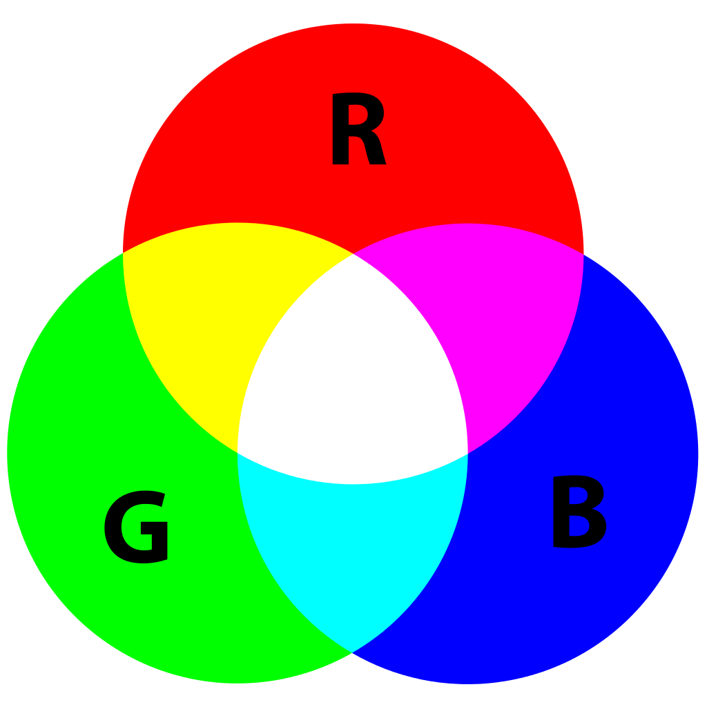

  

<h1 align="center" style="margin-top: -10px"> Colorbase </h1>

   Tool for checking displays for color or surface impurities.

## How to Use
Simply run the script or executable. It will display colors in fullscreen, starting with white. Press ENTER to cycle through colors, press ESC to quit.

## Credits
Written by telekrex. Please direct any suggestions, questions, or suspected security vulnerabilities to telekrex@gmail.com.